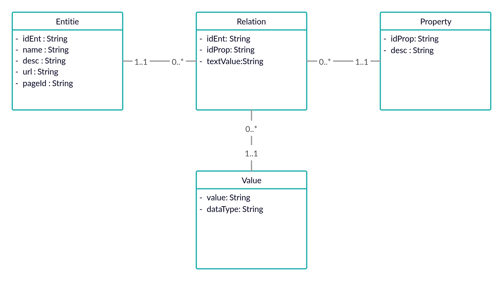

# QuestionAnswering

## Resumo:
  Este repositório contém o desenvolvimento de um projeto de IC, que consiste em uma ferramenta de perguntas e respostas com enfâse em linguagem informal, utilizando as bases de conhecimento estruturados da Wikidata e não estruturados da Wikipedia.

## Projeto Desenvolvido no Python 3.6.

## Bibliotecas:
### Processamento de textos
- unicode
- nltk
- spacy
- Wordnet

### Rotinas de requisições
- requests
- wikipedia
### Manipulação de dados
- sqlite3
- os
- pandas
### Desenvolvimento(opcionais)
- virtualenv
- jupyter

## Estado Atual

- Projeto funcionando com uma classe principal integrando todas as funcionalidades, em que recebe uma pergunta, processando-a e buscando correspondências nas bases de conhecimento. Ainda não o Processamento da resposta como uma frase.

- Classe principal Prif é responsável pela integração das funcionalidades do sistema, recebendo uma pergunta e retornando uma lista com possíveis respostas, utilizando o Wordnet para buscar sinônimos referentes as propriedades na pergunta.

- Classe QuestionProcessing: primeira versão com retorno de dicionario: {entidade, propriedade, indicadorPergunta, sinonimosPropriedade}, utilizando apenas o WordNet para desambiguar.

- Classe RotinaBD: busca a resposta a pergunta no banco de dados.

- Banco de dados modificado, novo tratamento dos valores, tendo uma nova tabela value.

## Como executar o projeto (versão atual):

### Executar como biblioteca: 

> Copie a pasta notebook para seu diretório.

> importe a classe prif no seu projeto: ```from notebook import prif```.

> instancie a classe: ```objeto = prif.Prif()```.

> utilize a função responder passando como parâmetro sua pergunta: ```prif.responder(sua_pergunta)```.

### Executar o projeto:

- Opcional:

  - Criar um Virtual environment:

  ```sh
  sudo pip3 install virtualenv
  virtualenv [nomeDaVM]
  ```
  - Preparar o ambiente virtual:
  ```sh
  source [nomeDaVM]/bin/activate
  ```

- Recomendado:

  - Clone o repositório:
  ```sh
  git clone [Repositório]
  ```
  - Vá para a pasta do repositório: 
  ```sh
  cd [Repositório]
  ```
  - Instale pacotes necessários:
  ```sh
  pip3 install -r requirements.txt
  ```
  - Suba o servidor de notebooks:
  ```sh
  jupyter notebook
  ```
  - Abra o arquivo notebook/Testar classe Prif.


## Diagrama da Arquitetura ao Final do Projeto 


## Diagrama do Banco de dados


