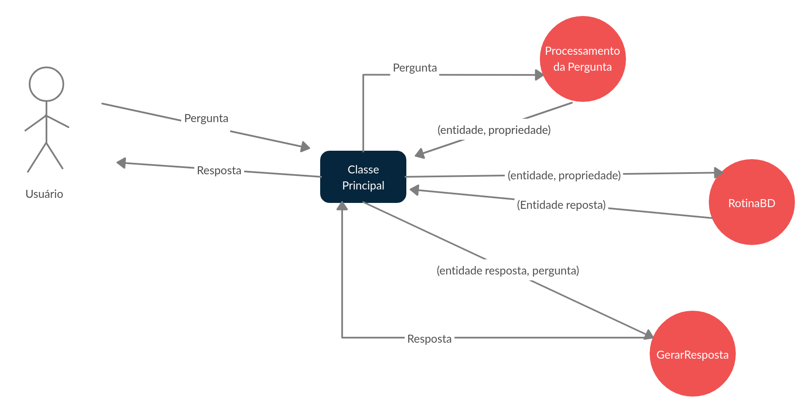

# QuestionAnswering

## Resumo:
  Este é um repositório contém o desenvolvimento de um projeto de IC, que consiste em uma ferramenta de perguntas e respostas com enfâse em linguagem informal, utilizando a base de conhecimento estruturados da Wikidata e não estruturados da Wikipedia.

## Projeto Desenvolvido no Python 3.6.

## Bibliotecas:
- unicode
- nltk
- spacy
- requests
- wikipedia
- sqlite3
- os
- pandas
### bibliotecas opcionais
- virtualenv
- jupyter

## Versão Atual
- Arquivo jupyter do processamento das perguntas, processando as perguntas e buscando a resposta utilizando a classe RotinaBD
- Classe RotinaBD que busca a resposta a pergunta no banco de dados.

## Como executar o projeto (versão atual):

> Criar a virtual env ```vitualenv [nomeDaVM]```

> Prepare o ambiente virtual ``` source [nomeDaVM]/bin/activate```

> Clone o repositório ```git clone [Repositório]```

> Vá para a pasta do repositório ```cd [Repositório]```

> Instalar pacotes necessários ```pip3 install -r requirements.txt```

> Suba o servidor de notebooks ```jupyter notebook```

## Diagrama da Arquitetura ao Final do Projeto 

