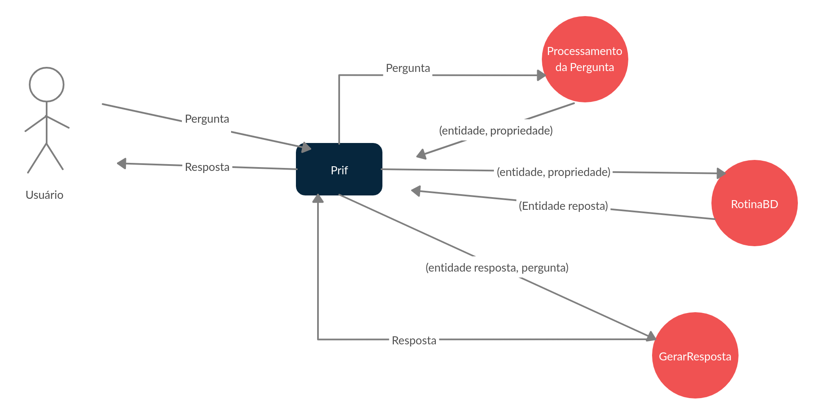
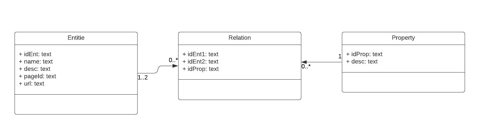

# QuestionAnswering

## Resumo:
  Este é um repositório contém o desenvolvimento de um projeto de IC, que consiste em uma ferramenta de perguntas e respostas com enfâse em linguagem informal, utilizando a base de conhecimento estruturados da Wikidata e não estruturados da Wikipedia.

## Projeto Desenvolvido no Python 3.6.

## Bibliotecas:
### Processamento de textos
- unicode
- nltk
- spacy

### Rotinas de requisições
- requests
- wikipedia
### Manipulação de dados
- sqlite3
- os
- pandas
### bibliotecas para desenvolvimento(opcionais)
- virtualenv
- jupyter

## Estado Atual

- Projeto funcionado com uma classe principal integrando todas as funcionalidades, recebendo uma pergunta, processando-a e buscando no banco de dados uma entidade de resposta. Ainda não há processamento de uma resposta e tratamento para resposta diferentes de uma entidade.
- Classe principal Prif responsável pela integração das funcionalidades do sistema, recebendo uma pergunta e retornando uma lista com tentativas de resposta para cada sinônimo referente a propriedade na pergunta. 
- Classe RotinaBD que busca a resposta a pergunta no banco de dados.
- Classe QuestionProcessing: primeira versão com retorno de dicionario: {entidade, propriedade, indicadorPergunta, sinonimoPropriedade}, utilizando apenas o WordNet para desambiguar.

## Como executar o projeto (versão atual):

- Opcional:

> Criar a virtual env ```vitualenv [nomeDaVM]```.

> Prepare o ambiente virtual ``` source [nomeDaVM]/bin/activate```.

- Recomendado:

> Clone o repositório ```git clone [Repositório]```.

> Vá para a pasta do repositório ```cd [Repositório]```.

> Instalar pacotes necessários ```pip3 install -r requirements.txt```.

> Suba o servidor de notebooks ```jupyter notebook```.

> Abra o arquivo notebook/Testar classe Prif.


## Outra maneira de execução (somente utilizar a classe Prif no seu projeto):

> Copie a pasta notebook.

> importe a classe prif: ```from notebook import prif```.

> instancie a classe: ```prif.Prif()```.

> utilize a função responder: ```prif.respoder(sua_pergunta)```.

## Diagrama da Arquitetura ao Final do Projeto 


## Diagrama do Banco de dados


